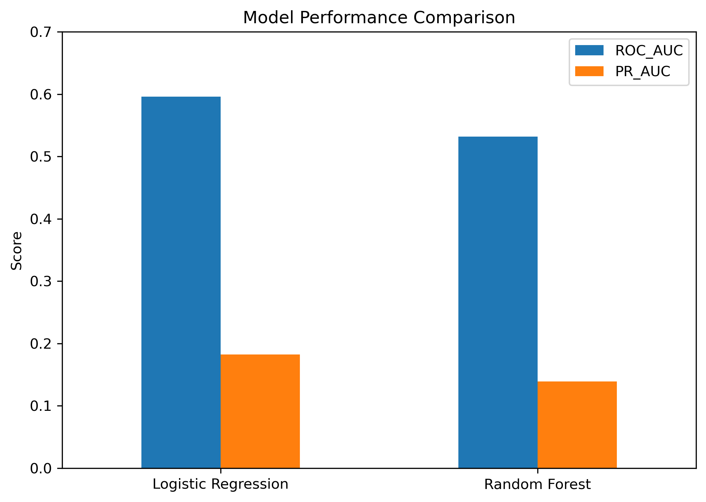
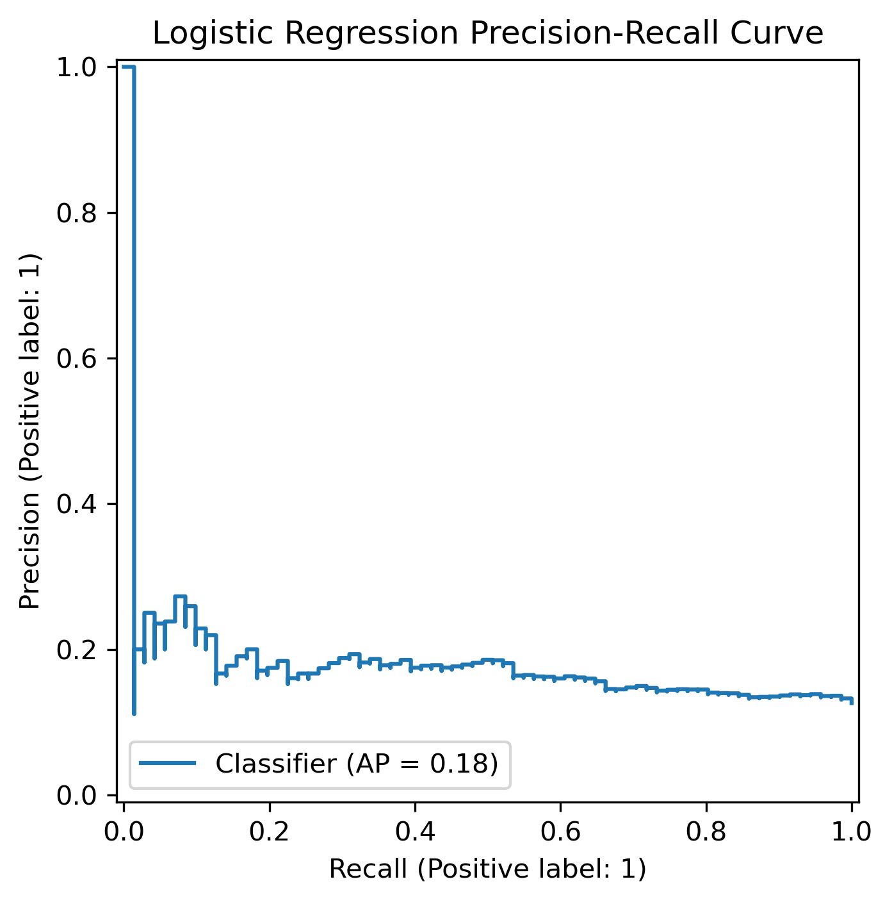
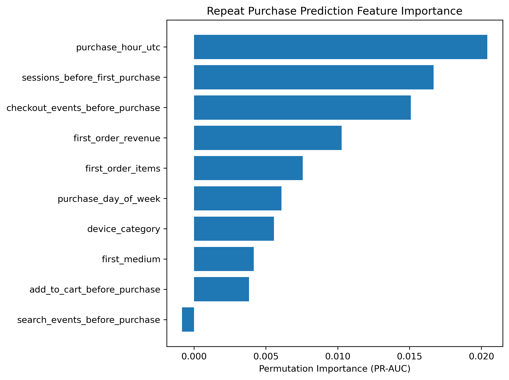

# Digital Commerce Growth Analytics


## Project Overview

This project analyzes digital commerce customer behavior using Google Analytics 4 e-commerce data to understand conversion, acquisition, retention, and repeat-purchase patterns.

The analysis combines **Google BigQuery SQL** for large-scale behavioral analysis with **Python machine learning** to evaluate whether first-purchase and pre-purchase behavior can help predict whether a customer will make another purchase within 30 days.

The project was designed as an end-to-end analytics workflow that moves from data quality validation and business KPI analysis to customer lifecycle analysis and predictive modeling.


## Project Objectives

The project focuses on five main business questions:

1. How does the e-commerce funnel perform from product view to checkout and purchase?
2. Which acquisition channels and customer segments show stronger conversion behavior?
3. How do product categories and customer behavior differ across the purchase journey?
4. What do cohort retention and repeat-purchase patterns reveal about customer lifecycle performance?
5. Can first-purchase behavior be used to predict a repeat purchase within 30 days?


## Tools & Technologies

- **Google BigQuery** - SQL querying and large-scale event analysis
- **SQL** - data validation, funnel analysis, KPI calculation, customer segmentation, cohort analysis
- **Python**
- **pandas** - data manipulation and analysis
- **NumPy** - numerical processing
- **scikit-learn** - classification modeling and model evaluation
- **Matplotlib** - data visualization
- **Jupyter Notebook** - exploratory analysis and machine learning workflow
- **Git & GitHub** - version control and project documentation


## Data & BigQuery Analysis

The project uses event-level e-commerce data in Google BigQuery and applies a structured SQL workflow before any machine learning is performed.

### 1. Data Quality Validation

Before calculating business metrics, purchase-event quality was audited to identify issues that could distort revenue or conversion analysis.

The validation process included:

- Checking purchase transaction IDs
- Identifying repeated transaction IDs
- Testing alternative order-grain definitions
- Reviewing purchase paths and funnel completeness
- Checking revenue and item quantity consistency
- Identifying placeholder or missing transaction values
- Comparing purchase-event counts with valid transaction counts

The audit showed that transaction tracking quality changed during the observation period, so downstream revenue and order metrics were calculated using validated purchase records rather than raw purchase-event counts.

### 2. Business KPI Analysis

Validated transactions were used to calculate core commerce metrics including:

- Orders
- Purchasers
- Revenue
- Average Order Value
- Items Sold
- Average Items per Order
- Daily revenue
- Daily order volume

The analysis was also segmented across major time periods to distinguish changes in traffic, conversion, and transaction quality.

### 3. Funnel Analysis

Session-level SQL logic was used to reconstruct the commerce funnel:

**Session → Product View → Checkout → Purchase**

Key funnel metrics included:

- Product view rate
- View-to-checkout rate
- Checkout-to-purchase rate
- Session conversion rate

Funnel performance was compared by:

- Time period
- Device category
- Acquisition source and medium
- New vs. returning users
- Product family

### 4. Marketing & Acquisition Analysis

Traffic was analyzed using first-touch source and medium dimensions.

Major acquisition groups included:

- Google Organic
- Direct
- Referral
- Google CPC
- Google Merchandise Store referral traffic
- Other traffic sources

For each channel, the analysis compared traffic share, product-view activity, checkout behavior, purchase activity, and downstream conversion performance.

### 5. Customer Lifecycle Analysis

Customer retention was analyzed using weekly acquisition cohorts and repeat-purchase behavior.

The SQL workflow included:

- Weekly cohort construction
- Week 1–8 retention measurement
- Weighted retention summaries
- Repeat-purchase rate analysis
- Time to second purchase
- 30-day customer segmentation

Customers were also grouped into lifecycle segments such as:

- One-Time Buyer
- Early Repeat Buyer
- Later Repeat Buyer

These analyses were used to connect acquisition and first-purchase behavior with longer-term customer value.


## Key Findings

### Returning Customers Converted Much More Efficiently

Returning users consistently showed stronger commerce-funnel performance than new users.

For example, during December:

- New users represented 73.44% of sessions but had a session conversion rate of only 0.76%.
- Returning users represented 26.56% of sessions but achieved a 3.90% session conversion rate.
- Checkout-to-purchase conversion reached 63.29% for returning users compared with 34.06% for new users.

This pattern suggests that customer familiarity and prior engagement were strongly associated with higher downstream purchase efficiency.

### Organic Search Was the Largest Acquisition Source

Google organic traffic accounted for roughly one-third of sessions across the analyzed periods:

- 30.69% during November 12–30
- 31.53% during December
- 32.06% during January 1–25

Direct traffic consistently represented approximately 23% of sessions, while referral traffic and Google CPC accounted for smaller shares.

Traffic volume alone, however, did not determine customer quality. Conversion and repeat-purchase behavior varied across acquisition channels.

### Retention Dropped Quickly After Acquisition

Weekly cohort analysis showed that customer retention declined sharply after the acquisition week.

Weighted retention results included:

| Cohort Month | Week 1 | Week 2 | Week 4 |
|---|---:|---:|---:|
| November 2020 | 4.88% | 2.22% | 1.05% |
| December 2020 | 2.71% | 0.90% | 0.73% |
| January 2021 | 3.49% | 1.27% | — |

The steep decline suggests that most users did not return regularly after their initial acquisition period.

### Most First-Time Buyers Did Not Repeat Within 30 Days

The machine-learning customer dataset contained 2,815 first-time purchasers.

- 2,460 customers (87.39%) did not make another purchase within 30 days.
- 355 customers (12.61%) made a repeat purchase within 30 days.

This class imbalance became an important consideration when evaluating predictive models.

### Repeat Buyers Represented Disproportionate Customer Value

Customer lifecycle segmentation showed that repeat purchasers represented a relatively small share of customers but contributed meaningfully more revenue per customer.

| Customer Segment | Customers | Customer Share | Avg. Revenue per Customer | Revenue Share |
|---|---:|---:|---:|---:|
| One-Time Buyer | 2,462 | 87.34% | $72.74 | 73.77% |
| Early Repeat Buyer | 275 | 9.76% | $179.57 | 20.34% |
| Later Repeat Buyer | 82 | 2.91% | $174.29 | 5.89% |

Early repeat buyers averaged 2.91 orders and generated approximately 2.5 times the revenue per customer of one-time buyers.

These results suggest that improving early repeat-purchase behavior could be a meaningful growth opportunity even if only a relatively small portion of first-time customers convert into repeat buyers.


## Machine Learning: 30-Day Repeat Purchase Prediction

A customer-level modeling dataset was created from first-purchase and pre-purchase behavioral features to predict whether a first-time buyer would make another purchase within 30 days.

### Modeling Dataset

The final dataset contained:

- 2,815 first-time purchasers
- 13 predictive features
- Binary target: `repeat_purchase_30d`
- Positive class rate: 12.61%

Predictive features included:

- Purchase day of week
- Purchase hour
- Device category
- First acquisition source
- First acquisition medium
- First-order revenue
- First-order item count
- Sessions before first purchase
- Product views before first purchase
- Add-to-cart events before first purchase
- Checkout events before first purchase
- Search events before first purchase
- Days from first visit to first purchase

A stratified 80/20 train-test split was used to preserve the repeat-purchase class distribution.

### Model Comparison

Two classification models were evaluated:

1. Logistic Regression
2. Random Forest

Because only 12.61% of customers belonged to the repeat-purchase class, ROC-AUC and PR-AUC were emphasized rather than relying on accuracy alone.

| Model | ROC-AUC | PR-AUC |
|---|---:|---:|
| Logistic Regression | 0.596 | 0.182 |
| Random Forest | 0.532 | 0.139 |

Logistic Regression performed better than Random Forest on both evaluation metrics and was retained as the preferred baseline model.



### Precision-Recall Performance

The Logistic Regression model achieved a PR-AUC of approximately **0.182**.

Threshold analysis showed that a threshold around **0.52** produced the highest observed F1 score of approximately **0.273**, compared with an F1 score of approximately **0.257** at the default 0.50 threshold.

The improvement was modest, suggesting that threshold adjustment alone was not enough to substantially improve repeat-purchase prediction.



### Feature Importance

Permutation importance using PR-AUC showed that the strongest predictive signals were:

1. Purchase hour
2. Sessions before first purchase
3. Checkout events before first purchase
4. First-order revenue
5. First-order item count



The importance values were relatively small overall, indicating that no single first-purchase feature strongly separated future repeat buyers from one-time buyers.

This result suggests that stronger retention models would likely require additional information such as post-purchase engagement, promotions, product-level purchase history, geography, or longer-term behavioral data.

### Model Interpretation

Logistic Regression coefficients were also examined to understand directional associations between customer characteristics and repeat purchasing.

For example:

- Referral traffic showed a positive association with repeat purchase behavior.
- Google CPC showed a negative association in the fitted model.
- Purchase timing variables appeared among several of the strongest model coefficients.

These relationships should be interpreted as **predictive associations, not causal effects**.


## Data Source

This project uses the **Google Analytics 4 Obfuscated Sample E-commerce Dataset** available through Google BigQuery.

The dataset contains event-level behavioral data from the Google Merchandise Store and includes information related to:

* Sessions and user activity
* Product views
* Cart and checkout events
* Purchases
* Devices
* Acquisition source and medium
* Product information
* E-commerce transaction values

Because the public dataset is obfuscated, several data-quality limitations were identified and explicitly addressed during the analysis.

---


## Repository Structure

```text
digital-commerce-growth-analytics/
│
├── data/
│   └── processed/
│       ├── ml_repeat_purchase_dataset.csv
│       ├── logistic_regression_coefficients.csv
│       ├── model_comparison.csv
│       └── permutation_importance.csv
│
├── notebooks/
│   └── 09_repeat_purchase_modeling.ipynb
│
├── sql/
│   ├── 00_data_quality_audit.sql
│   ├── 01_business_kpis.sql
│   ├── 02_product_funnel.sql
│   ├── 03_marketing_channel_analysis.sql
│   ├── 04_customer_analysis.sql
│   ├── 05_product_category_analysis.sql
│   ├── 06_lifecycle_retention.sql
│   ├── 07_repeat_purchase_analysis.sql
│   └── 08_ml_repeat_purchase_dataset.sql
│
└── visualizations/
    ├── repeat_purchase_precision_recall_curve.png
    ├── repeat_purchase_model_comparison.png
    └── repeat_purchase_feature_importance.png
```

---


## Data Quality & Limitations

Several limitations were identified during the analysis.


### Transaction Tracking

Transaction IDs were not consistently available throughout the full observation period.

* Early November purchase events contained little or no usable transaction ID coverage.
* Transaction coverage became substantially more reliable beginning in mid-November.
* Coverage deteriorated again near the end of January.
* Placeholder values such as `(not set)` were also present.

Because of these issues, **conversion analysis and transaction-level revenue analysis used different validated observation windows**.

Revenue, order, and AOV calculations were based only on transactions for which a defensible order-level identifier could be constructed.

### Product Metadata

Some product events contained missing or `(not set)` category values.

Product-mix analyses therefore compared results both with and without unknown product categories to avoid treating metadata quality changes as actual customer behavior.

### Retention Observation Windows

Later acquisition cohorts did not have enough future observation time to measure longer-term retention.

Unobservable future retention periods were treated as missing rather than zero.

### Machine Learning

The repeat-purchase model used only information observable through the first purchase.

The available features produced limited predictive performance:

* Logistic Regression ROC-AUC: **0.596**
* Logistic Regression PR-AUC: **0.182**

The models should therefore be interpreted as exploratory predictive baselines rather than production-ready customer targeting systems.

---


## Future Work

Several extensions could improve both the analytics and predictive components of the project.

### Experimentation

A future extension could design and evaluate a retention experiment such as:

* Personalized post-purchase incentives
* Loyalty offers
* Email re-engagement campaigns
* Product recommendations

This could include:

* Treatment and control groups
* Sample-size and power calculations
* Minimum Detectable Effect
* Hypothesis testing
* Confidence intervals
* Incremental conversion and revenue lift

### Additional Machine Learning Features

Predictive performance could potentially improve by incorporating:

* Product-level purchase history
* Promotion exposure
* Post-purchase engagement
* Geographic variables
* Customer lifetime activity
* Longer observation windows
* More detailed marketing interactions

### Business Intelligence

The analytical outputs can also be extended into an executive BI dashboard covering:

* Revenue and order KPIs
* Funnel performance
* Acquisition channels
* Customer retention
* Lifecycle segments
* Repeat-purchase probability

---


## Conclusion

This project demonstrates an end-to-end digital commerce analytics workflow combining:

**BigQuery SQL → Data Quality Validation → Business KPIs → Funnel Analysis → Marketing Analytics → Cohort Retention → Customer Lifecycle Analysis → Machine Learning**

The analysis found that repeat customers represented a relatively small portion of first-time purchasers but generated substantially greater 30-day customer value.

At the same time, the machine-learning results showed that first-purchase behavior alone provided only limited ability to distinguish future repeat purchasers, highlighting the importance of richer behavioral and lifecycle data for customer retention modeling.

Overall, the project illustrates how product, marketing, customer, and predictive analytics can be combined to move from raw event data to actionable business insights.
